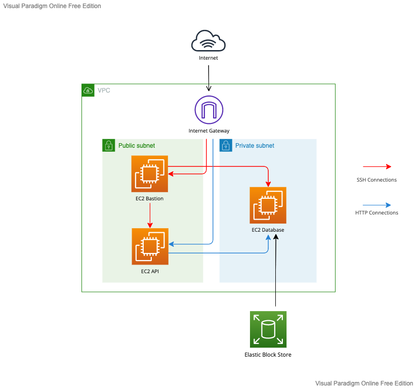

# Terraform AWS EC2 #

Securely deploying a containerized Go HTTP server and Postgres Database to AWS using Terraform and GitHub Actions.

## Overview ##

I created this repository in order to become more familiar with a number of core technologies used in Site Reliability and Platform Engineering. Namely; Terraform, GitHub Actions, and AWS. I deliberately avoided many of the managed resources provided by AWS which would have made this deployment much more straightforward (i.e. Elastic Container Registry and Amazon Relational Databases). This was simply in the interest of gaining more experience with managing my own EC2 instances and Docker containers, and thinking about solutions to more complex automation challenges. The project is not production ready and would no doubt benefit from converting to those aforementioned managed services.

I had three main aims in mind when I started working on this repository:

### Reproducibility ###

It should be possible to reproduce the entire application in the cloud with a minimal amount of manual set up. Once the user has configured the necessary secrets the application should build and deploy at the click of a button without requiring any manual server login or AWS console access.

### Security ###

Try to follow best practices as best as I can, in the limited capacity that I understand them coming to the field of Platform Engineering for the first time. This primarily relates to the design of the network architecture and designation of security groups to tightly control how different resources on the network can be accessed.

### Reliability ###

What happens to the API if the database server goes down temporarily? What happens to the data if the database server is destroyed altogether? I want to design a system which is resistant to changes in the underlying infrastructure.

## Architecture ##

## Secrets ##

This repository requires a number of secrets to be set in order to work correctly. You will also need to provide your own Organisation and Workspace names for Terraform Cloud.

### Terraform Cloud Variables ###

These secrets are declared in a shared variable set supplying multiple workspaces for the organisation on Terraform Cloud.

- `aws_secret_key`: the secret key of the AWS user.
- `aws_access_key`: the access key of the AWS user.
- `ssh_pub_key`: the public key of the SSH key pair used to access provisioned instances.

### GitHub Actions Secrets ###

These secrets are declared in the secrets section of the GitHub repository.

- `TF_API_KEY`: the access token for the user's Terraform Cloud account.
- `SSH_PRIVATE_KEY`: the private key of the SSH key pair used to access provisioned instances.
- `DOCKER_USER`: the user of the Docker Hub account.
- `DOCKER_PASSWORD`: the password of the Docker Hub user.
- `POSTGRES_DB`: the name of the Postgres database.
- `POSTGRES_USER`: the user of the Postgres database.
- `POSTGRES_PASSWORD`: the password of the Postgres database user.